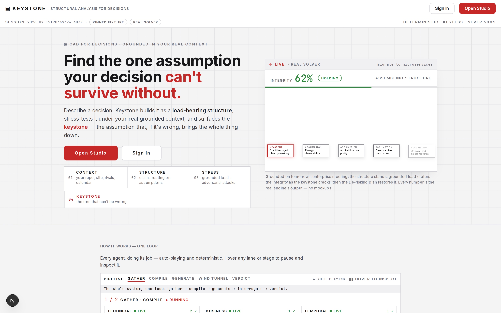
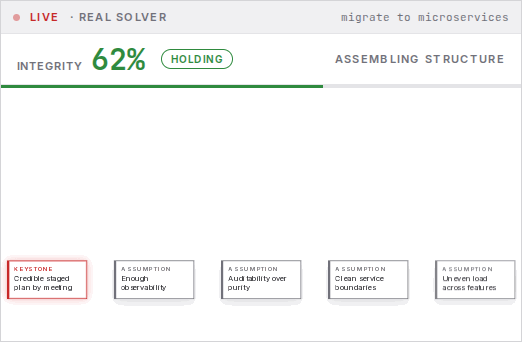
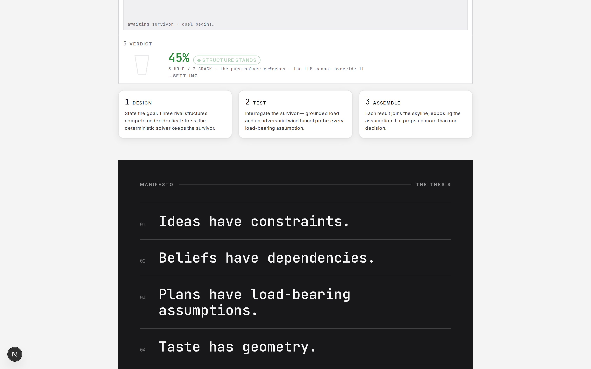
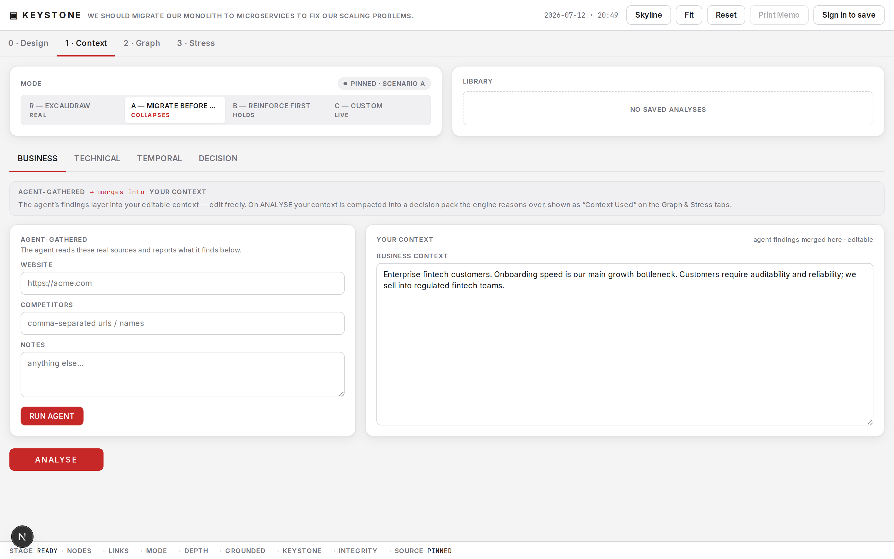
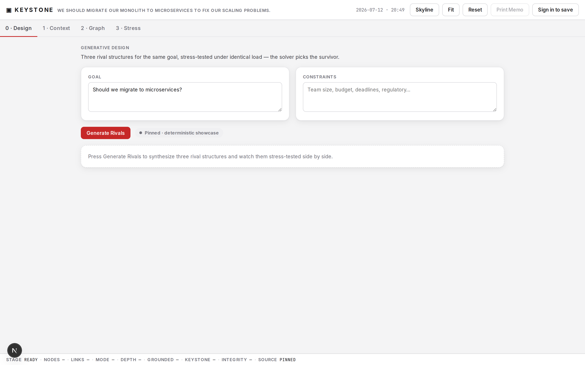
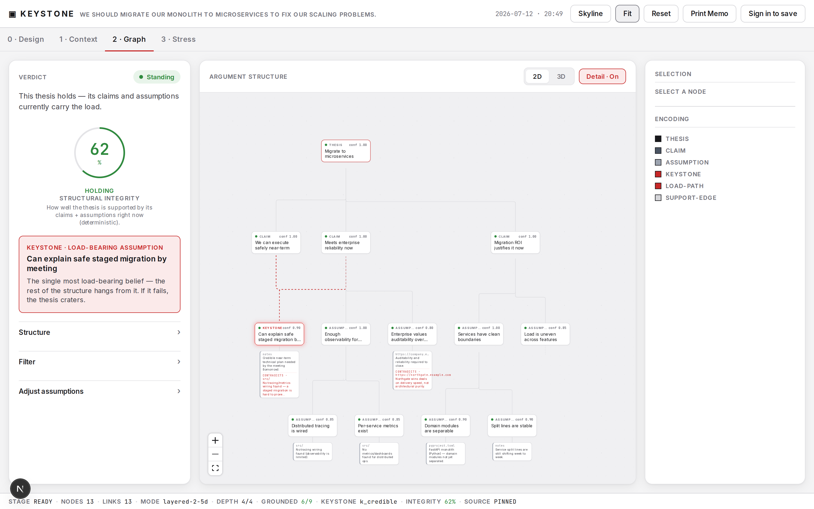
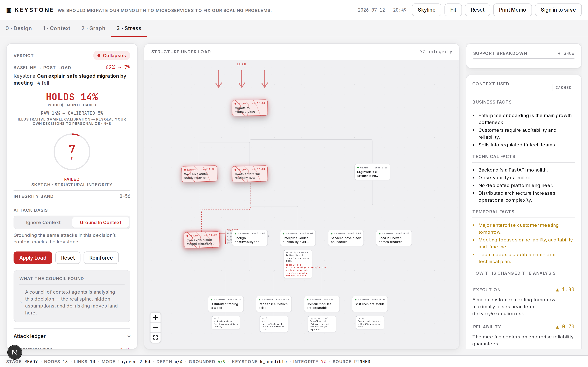

# ▣ Keystone — a CAD tool for thinking

> *"Ideas have constraints. Beliefs have dependencies. Plans have load-bearing assumptions.
> Taste has geometry. **What would a CAD tool for thinking look like?**"*

Keystone treats a decision the way an engineer treats a bridge: as a **load-bearing structure**.
An LLM proposes the shape — the thesis, the claims it rests on, the assumptions underneath — and a
**pure, deterministic solver** decides whether it stands: which assumption is the *keystone*, how it
fails under load, and the cheapest way to shore it up.



**The deterministic solver, in motion** — a structure assembles, takes grounded load, cracks at the
keystone, then the minimal de-risking plan heals it. Every number is the real engine's output, no mockups.



---

## Why

Every important decision hides a single assumption that quietly carries everything. Get it wrong and
the whole plan collapses — but it's rarely the one you're arguing about. Keystone finds it, shows you
*why* it's load-bearing, stress-tests the structure against your **real context**, and tells you the
one cheap thing to prove before you commit.

The whole thing runs on one honest rule: **the LLM proposes structure; the solver decides integrity.**
The model never moves the numbers — it only supplies a structure to analyze. Same inputs → same
verdict, every time.

---

## The idea: manifesto → mechanism

The manifesto names four properties of thought. Keystone renders each as engineering geometry.

| Manifesto line | What Keystone builds |
|---|---|
| **Ideas have constraints** | Context constraints become CAD **datum planes** the structure sits inside (`RUNWAY ≤ 7 MO`, `SLA 99.9%`). An attack that maps to a constraint **strikes** its plane — a visible collision, marked `VIOLATED`. |
| **Beliefs have dependencies** | The graph is an **AND/OR dependency network**. Support propagates from evidence up through assumptions and claims to the thesis; knock out a support and the loss ripples along the real edges. |
| **Plans have load-bearing assumptions** | A pure solver finds the **keystone** — the assumption whose removal costs the most integrity — via knock-out sensitivity, then computes the **minimal reinforcement set** that heals the structure. |
| **Taste has geometry** | Depth encodes *reasoning*, not decoration: `THESIS → CLAIMS → ASSUMPTIONS → EVIDENCE`. Grounded assumptions rest on evidence **plates**; ungrounded ones **float** with nothing beneath them. |



---

## Walk through it

### 1 · Context — ground it in reality

State the decision. Agents gather from **real sources** (your repo, website, competitors, calendar)
and their findings merge into your editable context; on analyse it's compacted into the pack the
engine reasons over.



### 2 · Design — three rivals, one survivor

One goal yields three **rival structures** under different strategy lenses (aggressive / conservative
/ hybrid), stress-tested under identical load. The pure engine ranks them by integrity — the survivor
wins. *The LLM never ranks.*



### 3 · Graph — the verdict

The studio shows the standing structure: **structural integrity**, the **probability it holds** under
sampled uncertainty (Monte-Carlo, calibrated to your track record), and the **keystone** called out in
red — the one belief the whole thesis hangs from.



### 4 · Stress — watch it crack

Apply the grounded load. The keystone cracks, the integrity craters, constraint planes show
`VIOLATED`, and the failure cascade orders *what breaks first and why* — then the de-risking plan
returns the minimal set of things to prove to make it survive.



---

## Under the hood

Keystone is a frozen deterministic engine wrapped in four analytical layers and an agentic context
pipeline. The engine math never changes; every feature reshapes the *load* and the *overlays*.

- **Deterministic engine (frozen).** Integrity, keystone (knock-out sensitivity), constraint
  violations, failure cascade, and the minimal reinforcement set — pure functions, no model, no
  randomness, no wall-clock. Dependency support propagates with a **depth-robust** rule (corroborating
  premises averaged via geometric mean, sub-goals multiplied) — not a naïve product.
- **Probabilistic layer.** A Monte-Carlo brain samples evidence-grounded uncertainty and correlated
  latent drivers over the frozen engine to produce **P(hold)** + a p05–p95 band, a variance keystone,
  and correlated co-failure clusters.
- **Cross-decision calibration.** Learns from your *resolved* decisions (shrunk bias-Platt + category
  rates) to turn a raw P(hold) into a **calibrated** one — honestly labelled sample-vs-real.
- **Contextual analysis council.** A server-side council of agents reads *this* decision's situation
  and reshapes the analysis: a SALC-style weighting agent names the **real spine** (which can differ
  from the topological keystone), a stress agent generates situation-specific attacks, a skeptic
  surfaces hidden assumptions, and a deterministic critic drops anything not grounded in real evidence.
- **De-risking.** Turns each finding — the real spine and the hidden assumptions — into one concrete,
  cheap falsifying test to run *before* committing.

### The honesty guarantees

- **The LLM cannot override the solver.** It supplies structure; code computes the verdict.
- **Every live path falls back to a pinned fixture.** Context, extraction, attacks, and the council
  each run live when `ANTHROPIC_API_KEY` is present, otherwise replay pinned outputs. API routes
  **never 500**, and each stage reports its true `live | fixture` source — fixtures are tagged
  *illustrative* and kept out of the engine.
- **The offline demo works fully, keyless** — deterministic and identical every run.

---

## Run it

```bash
npm i
npm run dev     # http://localhost:3000  — the offline demo works with no key
npm test        # engine + agents + UI suites (vitest) — 836 tests
```

`ANTHROPIC_API_KEY` in `.env.local` is **optional**. With it, the live gather chain, the contextual
council, and the judge-typed **CUSTOM** mode fire against real sources; without it, everything runs
from pinned fixtures. Model: `claude-opus-4-8`.

Signed-in accounts (Supabase) add a saved decision library and per-user calibration; the
`supabase/migrations/` folder holds the schema.

---

## Stack

Next.js 15 (App Router) · React 19 · TypeScript (strict) · `@xyflow/react` for the canvas ·
`@anthropic-ai/sdk` (forced-tool-call transport) · Supabase (RLS) · vitest · Playwright.

The design system is a single editorial theme (`src/ui/theme.css`) — white, near-black, gray, and a
keystone red, light-only — shared by the landing manifesto and the studio.
